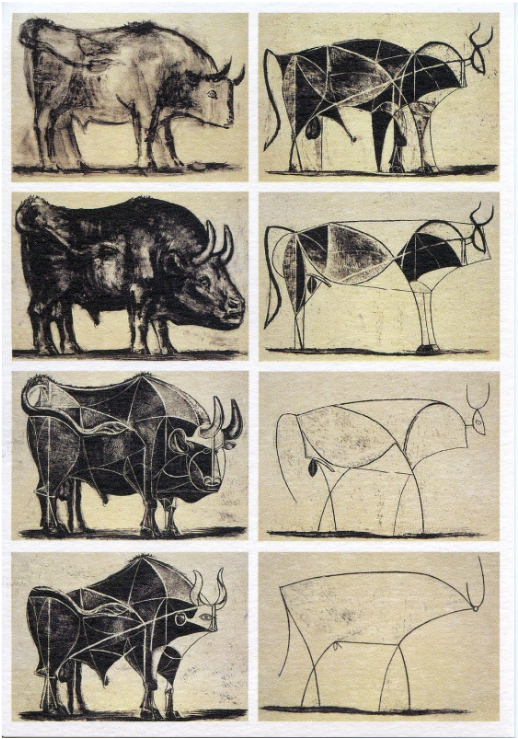
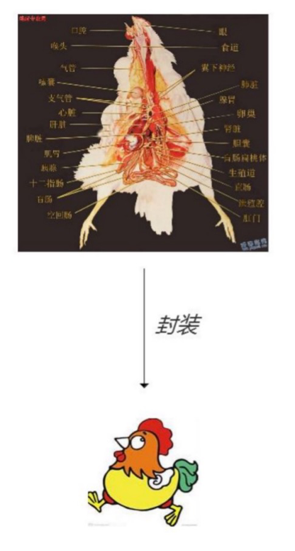

# 1.1 设计基础

<!-- ## 为什么要设计 -->

这个世界处于不断的变化中，需求也在不断的变化。为了应对需求的变化，减少变化影响的范围，我们需要进行设计。

## 如何进行设计

从下面四个方面进行设计：

- 抽象、封装为基本方法
- 高内聚、低耦合为评判标准
- 设计原则为指导思想
- 编程模式为套路模板

## 抽象

抽象的定义：从众多的具体事物中，抽取共同的、本质的属性

如上图所示，展示了逐步抽象的过程，具体过程如下：
1.左上图片展示了一个具有最多细节的、具体的牛
2.从上往下，从左往右依次进行抽象
3.最后抽象成了右下图片中的牛，这时候只剩下牛最基本的框架

更多的抽象案例：

- “红色、黄色、紫色”抽象为“颜色”
- “黑人、白人、黄人”抽象为“人”
- “鸡、鸭、鹅”抽象为“鸟”，它们具有共同的外观：头、身体、爪子、翅膀，以及共同的行为：吃、飞
<!-- TODO tu -->

### 项目中哪些地方用到了抽象？

可以说抽象无处不在，具体的应用如下：

- 在重构方面：消除重复代码时需要进行抽象，抽取它们共同的特性，消除这部分的重复
- 在设计方面：设计架构时需要进行抽象，抽取各个视图（如数据视图、层次视图、服务视图等）中的本质属性（如数据视图抽取数据相关的本质属性），形成各个视图的架构图
- 在测试方面：写测试用例时需要进行抽象，提取在用户的视角下被测试的代码有哪些行为，对这些行为进行测试

## 封装

封装的定义：隐藏对象的属性和实现细节，仅对外公开接口；将抽象得到的数据和行为相结合，形成一个有机的整体

如上图所示，展示了封装的一个例子，其中上方的图片展示了一只鸡的内部细节，包括各种器官等；下方的图片展示了封装后的结果，隐藏了内部细节，形成了“鸡”这个整体

### 项目中哪些地方用到了封装？

封装跟抽象一样，可以说无处不在，而且两者常一起使用。具体的应用如下：

- 在重构方面：重命名函数名时需要进行封装，使其不暴露内部的细节，而只显示这个函数的抽象行为，从而让用户只看函数名就知道它是做什么的
- 在设计方面：设计接口时需要进行封装，隐藏细节
- 在测试方面：写测试用例时需要进行封装，跟函数名一样，测试用例名应该不暴露内部的细节，而只显示该用例的抽象行为，从而让用户只看用例名就知道它是做什么的

## 高内聚、低耦合

在系统设计中通常用内聚度和耦合度作为衡量模块独立程度的标准，我们希望内聚度高，耦合度低。其中，内聚是指每个模块尽可能独立地完成自己的功能，不依赖模块外部的代码；耦合是指模块与模块之间相互依赖的程度，依赖得越多，耦合度越高，导致牵一发而动全身

让系统保持高内聚、低耦合的好处是使模块的“可重用性”、“移植性”大大增强

<!-- TODO tu
(TODO 需要去除水印) -->

