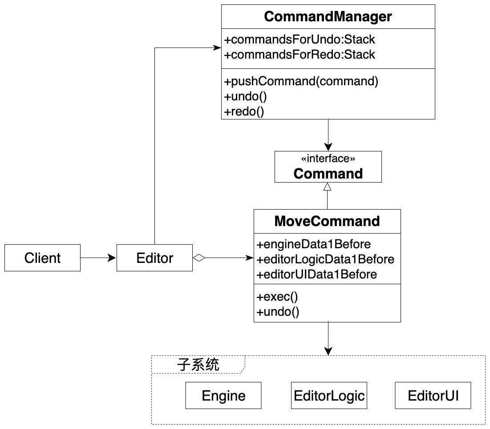
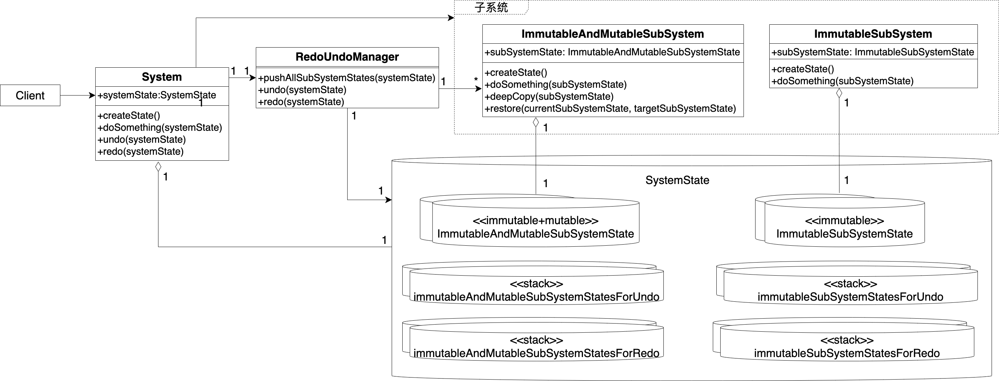

# 第7章 撤销重做模式

## 使用命令模式实现撤销重做

### 需求

我们实现了一个编辑器，它的子系统包括三个部分：引擎、编辑器逻辑、编辑器UI。我们在编辑器中实现了移动这个操作，它会操作编辑器的子系统，更新它们的数据。

现在需要实现编辑器的撤销和重做，其中撤销就是能够撤销编辑器最近的操作，恢复子系统的数据为操作前的数据；重做就是能够重新执行最近撤销的操作，再次更新子系统的数据


### 实现思路

使用设计模式中的“命令模式”，将编辑器的每个操作都建模为一个命令。因此，对于移动操作而言，将其建模为移动命令。

编辑器执行移动操作就是执行移动命令，此时应该依次执行下面的步骤：  
1.拷贝子系统的数据到命令中  
2.执行移动的逻辑，包括操作子系统，更新子系统的数据  
3.保存命令到撤销栈中

在编辑器撤销时，应该依次执行下面的步骤：  
1.从撤销栈中得到最近保存的命令  
2.调用该命令的撤销函数，它会恢复子系统为执行该命令前的数据  
3.将该命令保存到重做栈中

在编辑器重做时，应该依次执行下面的步骤：  
1.从重做栈中得到最近保存的命令  
2.执行该命令  
3.将该命令保存撤销栈中

值得注意的是：  
因为我们用函数式编程的函数而不是面向对象编程的类来实现编辑器的子系统和命令，所以它们的数据都保存在各自的闭包中而不是类的私有成员中

### 给出UML

**领域模型**



总体来看，领域模型分为用户、编辑器、子系统、命令、命令管理这五个部分


我们看下用户、编辑器这两个部分：

Client是用户

Editor是编辑器


我们看下子系统这个部分：

编辑器的子系统包括引擎-Engine、编辑器逻辑-EngineLogic、编辑器UI-EditorUI


我们看下命令这个部分：

Command是命令的接口

MoveCommand是移动命令，对应编辑器的移动操作，实现了Command接口，负责调用子系统的模块来实现移动的逻辑
<!-- ，拷贝它们数据 -->


我们看下命令管理这个部分：

CommandManager负责管理所有的命令，维护用来保存命令的撤销栈和重做栈


### 给出代码


首先，我们看下Client的代码

然后，我们依次看下Client代码中每个步骤的代码，它们包括：

- 打印数据的代码
- 移动操作的代码
- 撤销和重做的代码

最后，我们运行Client的代码


#### Client的代码

Client
```ts
//打印引擎、编辑器逻辑、编辑器UI的数据
Editor.printAllData()

Editor.move()

Editor.printAllData()

Editor.undo()

Editor.printAllData()

Editor.redo()

Editor.printAllData()
```

Client首先执行编辑器的移动操作；然后撤销（撤销最近的操作），也就是撤销移动操作；最后重做（重新执行最近撤销的操作)，也就是重新执行移动操作

每一步开始前我们都打印了当前的数据，用于运行测试，检查是否运行正确


#### 打印数据的代码

Editor
```ts
export let printAllData = () => {
    console.log("Engine->data1:", Engine.getData1())
    console.log("EditorLogic->data1:", EditorLogic.getData1())
    console.log("EditorUI->data1:", EditorUI.getData1())
}
```

printAllData函数打印了子系统的所有数据


我们看下子系统的相关代码：  
Engine
```ts
let _data1: number = 0

export let getData1 = () => {
    return _data1
}

export let setData1 = (data1) => {
    _data1 = data1
}
```
EditorLogic
```ts
let _data1: number = 0

export let getData1 = () => {
    return _data1
}

export let setData1 = (data1) => {
    _data1 = data1
}
```
EditorUI
```ts
let _data1: number = 0

export let getData1 = () => {
    return _data1
}

export let setData1 = (data1) => {
    _data1 = data1
}
```

子系统的每个模块只有一个数据-data1，保存在它们的闭包中（也就是保存在_data1中）


#### 移动操作的代码

Editor
```ts
export let move = () => {
    console.log("move")

    let moveCommand = MoveCommand.createCommand()

    moveCommand.exec()

    CommandManager.pushCommand(moveCommand)
}
```

move函数实现了移动操作，具体步骤如下：  
首先创建了移动命令；然后执行该命令；最后保存该命令到CommandManager的撤销栈中

我们看下MoveCommand的相关代码：
```ts
let _engineData1Before: number
let _editorLogicData1Before: number
let _editorUIData1Before: number

export let createCommand = (): command => {
    return {
        exec: () => {
            _engineData1Before = Engine.getData1()
            _editorLogicData1Before = EditorLogic.getData1()
            _editorUIData1Before = EditorUI.getData1()

            Engine.doWhenMove()
            EditorLogic.doWhenMove()
            EditorUI.doWhenMove()
        },
        ...
    }
}
```

createCommand函数创建并返回了实现Command接口的移动命令。该命令包括了exec函数，它实现了执行命令，具体步骤如下：  
1.拷贝子系统数据，具体是将执行前的子系统每个模块的data1数据分别拷贝到闭包的_engineData1Before、_editorLogicData1Before、_editorUIData1Before变量中保存  
2.调用子系统每个模块的doWhenMove函数来执行移动的逻辑


我们看下子系统的相关代码：  
Engine
```ts
export let doWhenMove = () => {
    _data1 += 1
}
```
EditorLogic
```ts
export let doWhenMove = () => {
    _data1 += 2
}
```
EditorUI
```ts
export let draw = () => {
    console.log("operate Dom to draw")
}

export let doWhenMove = () => {
    _data1 += 3

    draw()
}
```

子系统的每个模块的doWhenMove函数执行了移动的逻辑，更新了自己的数据

值得注意的是：  
EditorUI的doWhenMove函数除了更新自己的数据以外，还调用draw函数来操作Dom来绘制UI，这会更新页面Dom的状态（这里省略了相关代码）


我们看下CommandManager的相关代码：
```ts
let _commandsForUndo: Array<command> = []

let _commandsForRedo: Array<command> = []

export let pushCommand = (command: command) => {
    _commandsForUndo.push(command)
    _commandsForRedo = []
}
```

pushCommand函数将命令保存到撤销栈中，并且清空重做栈


#### 撤销和重做的代码

Editor
```ts
export let undo = () => {
    console.log("undo")

    CommandManager.undo()
}

export let redo = () => {
    console.log("redo")

    CommandManager.redo()
}
```

Editor的undo、redo函数分别调用了CommandManager的undo、redo函数来实现撤销和重做

我们看下CommandManager的undo函数的相关代码：
```ts
export let undo = () => {
    let command = _commandsForUndo.pop()

    command.undo()

    _commandsForRedo.push(command)
}
```

CommandManager的undo函数从撤销栈中得到最近保存的命令，调用了命令的undo函数，我们看下命令的相关代码：  
MoveCommand
```ts
export let createCommand = (): command => {
    return {
        ...
        undo: () => {
            Engine.setData1(_engineData1Before)
            EditorLogic.setData1(_editorLogicData1Before)
            EditorUI.setData1(_editorUIData1Before)

            EditorUI.undraw()
        }
    }
}
```
EditorUI
```ts
export let undraw = () => {
    console.log("operate Dom to undraw")
}
```

MoveCommand的undo函数实现了命令的撤销，恢复了子系统的数据

值得注意的是：  
MoveCommand的undo函数还调用EditorUI的undraw函数来撤销EditorUI的绘制，这会还原页面Dom的状态（这里省略了相关代码）


我们继续看下CommandManager的redo函数的相关代码：  
CommandManager
```ts
export let redo = () => {
    if (_commandsForRedo.length === 0) {
        console.log("do nothing")
        return
    }

    let command = _commandsForRedo.pop()

    command.exec()

    _commandsForUndo.push(command)
}
```

CommandManager的redo函数从重做栈中得到最近保存的命令，调用了命令的exec函数来执行该命令

#### 运行Client的代码

下面，我们运行Client的代码，打印的结果如下：
```js
Engine->data1: 0
EditorLogic->data1: 0
EditorUI->data1: 0
move
operate Dom to draw
Engine->data1: 1
EditorLogic->data1: 2
EditorUI->data1: 3
undo
operate Dom to undraw
Engine->data1: 0
EditorLogic->data1: 0
EditorUI->data1: 0
redo
operate Dom to draw
Engine->data1: 1
EditorLogic->data1: 2
EditorUI->data1: 3
```
这里打印的move、undo、redo分别表示进行了移动、撤销、重做

在执行移动操作前，子系统每个模块的data1都为初始值：0；执行移动操作后，操作了Dom来绘制，并且子系统每个模块的data1分别更新为1、2、3；撤销后，操作了Dom来撤销绘制，并且子系统每个模块的data1都恢复为初始值0；重做后，再次操作了Dom来绘制，并且子系统每个模块的data1再次更新为1、2、3。


### 提出问题

- 命令的实现成本高  
命令需要实现子系统的数据（如data1数据）和状态（如页面Dom的状态）的拷贝、恢复逻辑

- 子系统的变化会影响命令  
当子系统的数据和状态有变化时，所有相关的命令都需要对应修改。通常一个系统会有几十个甚至上百个操作，那么就有对应的几十上百个命令。命令的数量越多，上面提出的问题就越严重

<!-- 假设Editor有10个操作，那么就有对应的10个命令。
假设每个命令都操作了子系统1，那么首先每个命令都需要实现子系统1的数据的“拷贝、恢复、状态撤销”的逻辑；
另外，如果子系统1的数据修改时，这10个命令也需要对应修改对子系统1数据的拷贝、恢复、状态撤销的逻辑

终上所述，命令越多，实现成本和维护成本就越高 -->


## 使用撤销重做模式来改进

### 概述解决方案

- 将子系统中每个模块的数据集中起来，保存在state中  
每个模块有一个state，它包括了不可变数据和可变数据。对于不可变数据，因为它是唯一的，不存在共享的情况，所以在撤销、重做时无需被拷贝、恢复；对于可变数据，由子系统的对应模块集中地实现它们的拷贝和恢复。
我们应该确保state中的数据尽量为不可变数据。

- 使用一个大的EditorState来保存子系统中各个模块的state，方便集中管理

- 进行某个操作（如移动操作）时，将当前的EditorState中的各个模块的state保存到对应的栈中；在撤销或者重做时，从对应的栈中取出最近保存的各个模块的state，将其写到当前的EditorState中，从而将其替换为当前的模块state


- 子系统尽量不要操作状态  
因为状态不能保存到state中，且它跟可变数据一样需要拷贝、恢复，所以应该尽量不要操作状态，如EditorUI可以改为使用React或者Vue等UI框架，因此不需要直接操作Dom而改变页面Dom的状态，改为只操作数据


### 给出UML

**领域模型**


总体来看，领域模型分为用户、编辑器、子系统、EditorState、撤销重做管理这五个部分


我们看下用户、编辑器这两个部分：

Client是用户

Editor是编辑器，有一个EditorState数据


我们看下子系统这个部分：

每个子系统模块都有一个自己的state，其中Engine有一个EngineState，EditorLogic有一个EditorLogicState，EditorUI有一个EditorUIState。每个子系统模块都有createState函数，用于创建自己的state

Engine相比其它两个模块，多出了deepCopy和restore函数，它们分别用来深拷贝和恢复EngineState中的可变数据。具体来说，在保存EngineState到EditorState的撤销栈（engineStatesForUndo）或者重做栈（engineStatesForRedo）时，需要调用Engine的deepCopy函数来深拷贝EngineState中的可变数据；从EditorState的撤销栈或者重做栈中取出EngineState后，需要调用Engine的restore函数对EngineState中的可变数据进行恢复
<!-- ，然后再将其设置为当前的EditorState中的EngineState -->

因为EditorUI改为使用React或者Vue等UI框架，从而不需要直接操作Dom，只操作数据即可，所以现在EditorUI没有draw、undraw这种操作Dom的函数


我们看下EditorState这个部分：

EditorState保存了编辑器的所有数据，包括所有子系统模块的state：EngineState、EditorLogicState、EditorUIState，以及用来保存子系统的模块state的撤销栈和重做栈。每个子系统的模块state都有对应的一个撤销栈和一个重做栈

EngineState包括了不可变和可变数据，其中可变数据包括：

- WebGL创建的对象，如WebGLBuffer  
因为WebGL是使用面向对象范式的，它创建的对象是类的对象，所以它们都是可变数据
- 性能热点相关的数据  
因为更新可变数据时不需要拷贝，性能更好，所以性能热点相关的数据应该尽量为可变数据

EditorLogicState、EditorUIState只有不可变数据，因为它们既不需要与WebGL交互，也没有性能热点数据（因为引擎是性能热点，而编辑器逻辑和编辑器UI不是性能热点）


我们看下撤销重做管理这个部分：

RedoUndoManager负责实现撤销和重做，维护EditorState中的撤销栈和重做栈


<!-- **依赖关系** -->
我们来看下依赖关系：

因为只有EngineState有可变数据，所以RedoUndoManager的undo和redo函数只调用了Engine的deepCopy、restore函数来处理EngineState，没有调用其它子系统模块，因此RedoUndoManager只依赖了子系统中的Engine


### 结合UML图，描述如何具体地解决问题

- 现在只需要集中地实现子系统的模块state中可变数据的拷贝、恢复逻辑，降低了实现成本

- 子系统的模块state的变化最多只影响该state所属的子系统模块  
当修改子系统的模块state中不可变数据时，因为它无需被拷贝或者撤销，没有被任何模块依赖，所以可以直接修改而不影响任何模块；
当修改子系统的模块state中可变数据时，只影响该state所属的子系统模块，如修改EngineState的可变数据时，只需要修改Engine的deepCopy和restore函数，Engine的其它函数以及其它模块不需要修改


### 给出代码

首先，我们看下Client的代码

然后，我们依次看下Client代码中每个步骤的代码，它们包括：

- 创建EditorState的代码
- 打印数据的代码
- 移动操作的代码
- 撤销和重做的代码

最后，我们运行Client的代码


#### Client的代码 

Client
```ts
let state = Editor.createState()

Editor.printAllData(state)

state = Editor.move(state)

Editor.printAllData(state)

state = Editor.undo(state)

Editor.printAllData(state)

state = Editor.redo(state)

Editor.printAllData(state)
```

现在在最开始时加入了一步：创建了EditorState，后面的步骤跟之前一样，只是每一步的函数都传入和返回了EditorState，这是操作state的通用模式，具体说明如下：  
在函数式编程中，数据与逻辑是分开的，其中所有的数据都保存到state中，通常会有一个最大的state；逻辑则由函数实现。调用函数时，要将state传入，并且返回更新后的state


#### 创建EditorState的代码

Editor
```ts
//EditorState的类型
export type state = {
    //撤销栈和重做栈
    engineStatesForUndo: Stack<Engine.state>,
    engineStatesForRedo: Stack<Engine.state>,
    editorLogicStatesForUndo: Stack<EditorLogic.state>,
    editorLogicStatesForRedo: Stack<EditorLogic.state>,
    editorUIStatesForUndo: Stack<EditorUI.state>,
    editorUIStatesForRedo: Stack<EditorUI.state>,
    //子系统的模块state
    engineState: Engine.state,
    editorLogicState: EditorLogic.state,
    editorUIState: EditorUI.state
}

export let createState = (): state => {
    return {
        engineStatesForUndo: Stack(),
        engineStatesForRedo: Stack(),
        editorLogicStatesForUndo: Stack(),
        editorLogicStatesForRedo: Stack(),
        editorUIStatesForUndo: Stack(),
        editorUIStatesForRedo: Stack(),
        engineState: Engine.createState(),
        editorLogicState: EditorLogic.createState(),
        editorUIState: EditorUI.createState()
    }
}
```

createState函数创建并返回了EditorState，它包含子系统所有模块的state，以及对应的撤销、重做栈。

我们看到每个子系统模块的state对有一个对应的撤销栈和一个对应的重做栈


#### 打印数据的代码

Editor
```ts
export let printAllData = ({ engineState, editorLogicState, editorUIState }: state) => {
    console.log("Engine->state:", engineState)
    console.log("EditorLogic->state:", editorLogicState)
    console.log("EditorUI->state:", editorUIState)
}
```

printAllData函数打印了EditorState中子系统所有模块的state


#### 移动操作的代码

Editor
```ts
export let move = (state: state) => {
    console.log("move")

    state = RedoUndoManager.pushAllSubSystemStates(state)

    let engineState = Engine.doWhenMove(state.engineState)
    let editorLogicState = EditorLogic.doWhenMove(state.editorLogicState)
    let editorUIState = EditorUI.doWhenMove(state.editorUIState)

    return {
        ...state,
        engineState,
        editorLogicState,
        editorUIState
    }
}
```


move函数实现了移动操作，具体步骤如下：  
1.调用RedoUndoManager的pushAllSubSystemStates函数来保存EditorState中的子系统每个模块的state到对应的撤销栈中  
2.调用子系统每个模块的doWhenMove函数来执行移动的逻辑  
3.更新EditorState中子系统每个模块的state

我们看下RedoUndoManager的相关代码：
```ts
export let pushAllSubSystemStates = (editorState: Editor.state): Editor.state => {
    return {
        ...editorState,
        engineStatesForUndo: editorState.engineStatesForUndo.push(
            Engine.deepCopy(editorState.engineState)
        ),
        editorLogicStatesForUndo: editorState.editorLogicStatesForUndo.push(editorState.editorLogicState),
        editorUIStatesForUndo: editorState.editorUIStatesForUndo.push(editorState.editorUIState),
        //清空redo栈
        engineStatesForRedo: Stack(),
        editorLogicStatesForRedo: Stack(),
        editorUIStatesForRedo: Stack()
    }
}
```


pushAllSubSystemStates函数保存EditorState中的子系统每个模块的state到对应的撤销栈中，并且将重做栈清空了。

因为EngineState中有可变数据，所以先调用Engine的deepCopy函数对其进行深拷贝，然后再将拷贝后的state保存到Engine的撤销栈（engineStatesForUndo）中。而EditorLogicState、EditorUIState都是不可变的，所以无需拷贝


<!-- 我们看下子系统的相关代码： -->

我们看下子系统的Engine的代码：
```ts
//一些字段是不可变的，另外的字段是可变的
export type state = {
    immutableData1: number,
    mutableData2: Array<number>
}

export let createState = (): state => {
    return {
        immutableData1: 0,
        mutableData2: [1]
    }
}

export let doWhenMove = (state: state) => {
    //更新不可变字段
    //先浅拷贝state，再修改拷贝后的state中的对应字段
    state = {
        ...state,
        immutableData1: state.immutableData1 + 1
    }

    //更新可变字段
    //直接修改原始数据
    state.mutableData2.push(1)

    return state
}

//深拷贝可变字段
export let deepCopy = (state: state): state => {
    return {
        ...state,
        mutableData2: state.mutableData2.slice()
    }
}
```

createState函数创建了EngineState，它的immutableData1是不可变数据，mutableData2是可变数据。在deepCopy函数中，只对EngineState的可变字段mutableData2进行了深拷贝，其它不可变的字段则没有被拷贝，而是直接被赋值到浅拷贝后新的EngineState中


我们看下子系统另外两个模块的代码：  
EditorLogic
```ts
//所有字段都是不可变的
export type state = {
    data1: number
}

export let createState = (): state => {
    return {
        data1: 0
    }
}

export let doWhenMove = (state: state) => {
    return {
        ...state,
        data1: state.data1 + 2
    }
}
```
EditorUI
```ts
//所有字段都是不可变的
export type state = {
    data1: number
}

export let createState = (): state => {
    return {
        data1: 0
    }
}

export let doWhenMove = (state: state) => {
    return {
        ...state,
        data1: state.data1 + 3
    }
}
```


EditorLogicState、EditorUIState只有不可变数据。另外，因为现在EditorUI无需操作Dom状态，所以没有draw、undraw函数了


#### 撤销和重做的代码

Editor
```ts
export let undo = (state: state) => {
    console.log("undo")

    return RedoUndoManager.undo(state)
}

export let redo = (state: state) => {
    console.log("redo")

    return RedoUndoManager.redo(state)
}
```

Editor的undo、redo函数分别调用了RedoUndoManager的undo、redo函数来实现撤销和重做

我们看下RedoUndoManager的undo函数的代码：
```ts
export let undo = (editorState: Editor.state): Editor.state => {
    //处理EngineState

    let previousEngineState = editorState.engineStatesForUndo.first()
    let engineStatesForUndo = editorState.engineStatesForUndo.pop()

    //进栈前先深拷贝
    let engineStatesForRedo = editorState.engineStatesForRedo.push(Engine.deepCopy(editorState.engineState))

    //恢复
    previousEngineState = Engine.restore(editorState.engineState, previousEngineState)

    //处理EditorLogicState
    //不需要深拷贝和恢复

    let previousEditorLogicState = editorState.editorLogicStatesForUndo.first()
    let editorLogicStatesForUndo = editorState.editorLogicStatesForUndo.pop()

    let editorLogicStatesForRedo = editorState.editorLogicStatesForRedo.push(editorState.editorLogicState)

    EditorUIState的逻辑跟EditorLogicState的逻辑一样，故省略...

    return {
        ...editorState,
        engineStatesForUndo,
        editorLogicStatesForUndo,
        ...
        engineStatesForRedo,
        editorLogicStatesForRedo,
        ...

        //替换当前子系统各个模块的state
        engineState: previousEngineState,
        editorLogicState: previousEditorLogicState,
        ...
    }
}
```

undo函数依次按照下面的步骤处理子系统的三个模块：  
1.将保存在对应的撤销栈的模块state取出来  
2.将当前的模块state保存到对应的重做栈中  
3.将第一步取出来的模块state写到当前的EditorState中，从而将其替换为当前的模块state

值得注意的是：  
因为引擎的EngineState有可变数据，所以对其进行了深拷贝和恢复的处理


我们看下RedoUndoManager的redo函数的代码：
```ts
export let redo = (editorState: Editor.state): Editor.state => {
    ...

    //处理EngineState

    let nextEngineState = editorState.engineStatesForRedo.first()
    let engineStatesForRedo = editorState.engineStatesForRedo.pop()

    //进栈前先深拷贝
    let engineStatesForUndo = editorState.engineStatesForUndo.push(Engine.deepCopy(editorState.engineState))

    //恢复
    nextEngineState = Engine.restore(editorState.engineState, nextEngineState)

    //处理EditorLogicState
    //不需要深拷贝和恢复

    let nextEditorLogicState = editorState.editorLogicStatesForRedo.first()
    let editorLogicStatesForRedo = editorState.editorLogicStatesForRedo.pop()

    let editorLogicStatesForUndo = editorState.editorLogicStatesForUndo.push(editorState.editorLogicState)

    EditorUIState的逻辑跟EditorLogicState的逻辑一样，故省略...

    return {
        ...editorState,
        engineStatesForUndo,
        editorLogicStatesForUndo,
        ...
        engineStatesForRedo,
        editorLogicStatesForRedo,
        ...

        //替换当前子系统各个模块的state
        engineState: nextEngineState,
        editorLogicState: nextEditorLogicState,
        ...
    }
}
```

redo函数的步骤与undo函数的步骤类似


#### 运行Client的代码

下面，我们运行Client的代码，打印的结果如下：
```js
Engine->state: { immutableData1: 0, mutableData2: [ 1 ] }
EditorLogic->state: { data1: 0 }
EditorUI->state: { data1: 0 }
move
Engine->state: { immutableData1: 1, mutableData2: [ 1, 1 ] }
EditorLogic->state: { data1: 2 }
EditorUI->state: { data1: 3 }
undo
Engine->state: { immutableData1: 0, mutableData2: [ 1 ] }
EditorLogic->state: { data1: 0 }
EditorUI->state: { data1: 0 }
redo
Engine->state: { immutableData1: 1, mutableData2: [ 1, 1 ] }
EditorLogic->state: { data1: 2 }
EditorUI->state: { data1: 3 }
```

运行结果的步骤与之前一样，只是打印的值不一样


## 定义

### 一句话定义

将数据集中地保存在state中，其中的不可变数据无需被拷贝和恢复

### 补充说明

操作时保存state到栈中；撤销和重做时从栈中取出最近保存的state来替换为当前的state

确保state中的数据尽量为不可变数据。对于state中的可变数据，由子系统的对应模块集中地实现它们的拷贝和恢复

### 通用UML

**领域模型**




<!-- ### 分析角色 -->


<!-- 我们来看看模式的相关角色： -->


总体来看，领域模型分为用户、System、子系统、SystemState、撤销重做管理这五个部分


我们看下用户这个部分：

- Client  
该角色是用户


我们看下System这个部分：

- System  
该角色是门户，有一个SystemState数据。下面介绍它的函数：  
System的createState函数创建了SystemState；System的doSomething函数实现了某个操作；System的undo函数实现了撤销；System的redo函数实现了重做


我们看下子系统这个部分：

- ImmutableSubSystem  
该角色是子系统的一个模块，有一个ImmutableSubSystemState，它只有不可变数据

- ImmutableAndMutableSubSystem  
该角色是子系统的一个模块，有一个ImmutableAndMutableSubSystemState，它既包括不可变数据又包括可变数据。其中，图形API创建的对象、性能热点数据通常是可变数据；其它数据则尽量是不可变数据。  
该角色相比ImmutableSubSystem，需要多实现deepCopy、restore这两个函数，分别用来深拷贝和恢复ImmutableAndMutableSubSystemState中的可变数据


我们看下SystemState这个部分：

- SystemState  
该角色保存了System的所有数据，包括了所有子系统模块的state，以及用来保存子系统的模块state的撤销栈和重做栈


我们看下撤销重做管理这个部分：

- RedoUndoManager  
该角色负责实现撤销和重做，维护SystemState中的撤销栈和重做栈


**角色之间的关系**

- 只有一个SystemState，它保存了系统的所有数据

- 子系统可以有多个ImmutableAndMutableSubSystem模块和多个ImmutableSubSystem模块

- 子系统的每个模块只有一个state，它保存在SystemState中

- 每个子系统的模块state都有对应的一个撤销栈和一个重做栈，它们保存在SystemState中 


<!-- **依赖关系** -->

- 因为只有ImmutableAndMutableSubSystemState有可变数据，所以RedoUndoManager的undo和redo函数只调用了ImmutableAndMutableSubSystem的deepCopy、restore函数来处理ImmutableAndMutableSubSystemState，没有调用其它子系统模块，因此RedoUndoManager只依赖了子系统中的ImmutableAndMutableSubSystem


### 角色的抽象代码


下面我们来看看各个角色的抽象代码：

我们依次看下领域模型中用户、System、子系统、撤销重做管理这几个部分的抽象代码：  
首先，我们看下Client的抽象代码  
然后，我们看下System的抽象代码  
然后，我们看下子系统的各个模块的抽象代码，它们包括：

- ImmutableSubSystem的抽象代码
- ImmutableAndMutableSubSystem的抽象代码

最后，我们看下RedoUndoManager的抽象代码


#### Client的抽象代码
Client
```ts
let state = System.createState()

state = System.doSomething(state)

state = System.undo(state)

state = System.redo(state)
```

#### System的抽象代码
System
```ts
export type state = {
    //撤销栈和重做栈
    immutableAndMutableSubSystem1StatesForUndo: Stack<ImmutableAndMutableSubSystem1.state>,
    immutableAndMutableSubSystem1StatesForRedo: Stack<ImmutableAndMutableSubSystem1.state>,
    immutableSubSystem1StatesForUndo: Stack<ImmutableSubSystem1.state>,
    immutableSubSystem1StatesForRedo: Stack<ImmutableSubSystem1.state>,
    //子系统的模块state
    immutableAndMutableSubSystem1State: ImmutableAndMutableSubSystem1.state,
    immutableSubSystem1State: ImmutableSubSystem1.state,

}

export let createState = (): state => {
    return {
        immutableAndMutableSubSystem1StatesForUndo: Stack(),
        immutableAndMutableSubSystem1StatesForRedo: Stack(),
        immutableSubSystem1StatesForUndo: Stack(),
        immutableSubSystem1StatesForRedo: Stack(),
        immutableAndMutableSubSystem1State: ImmutableAndMutableSubSystem1.createState(),
        immutableSubSystem1State: ImmutableSubSystem1.createState(),
    }
}

export let doSomething = (state: state) => {
    state = RedoUndoManager.pushAllSubSystemStates(state)

    let immutableAndMutableSubSystem1State = ImmutableAndMutableSubSystem1.doSomething(state.immutableAndMutableSubSystem1State)

    let immutableSubSystem1State = ImmutableSubSystem1.doSomething(state.immutableSubSystem1State)

    return {
        ...state,
        immutableAndMutableSubSystem1State,
        immutableSubSystem1State
    }
}

export let undo = (state: state) => {
    return RedoUndoManager.undo(state)
}

export let redo = (state: state) => {
    return RedoUndoManager.redo(state)
}
```


这里假设子系统只有一个ImmutableSubSystem和一个ImmutableAndMutableSubSystem


#### ImmutableSubSystem的抽象代码
ImmutableSubSystem1
```ts
//所有字段都是不可变的
export type state = {
    immutable数据: xxx,
}

export let createState = (): state => {
    return {
        immutable数据: 初始值1,
    }
}

export let doSomething = (state: state) => {
    return {
        ...state,
        immutable数据: 更新immutable数据(state.immutable数据)
    }
}
```


有多个ImmutableSubSystem，这里只给出一个ImmutableSubSystem的抽象代码

#### ImmutableAndMutableSubSystem的抽象代码
ImmutableAndMutableSubSystem
```ts
//一些字段是不可变的，另外的字段是可变的
export type state = {
    immutable数据: xxx,
    mutable数据: xxx
}

export let createState = (): state => {
    return {
        immutable数据: 初始值1,
        mutable数据: 初始值2
    }
}

export let doSomething = (state: state) => {
    state = {
        ...state,
        immutable数据: 更新immutable数据(state.immutable数据)
    }

    更新mutable数据(state.mutable数据)

    return state
}

export let deepCopy = (state: state): state => {
    return {
        ...state,
        mutable数据: 深拷贝(state.mutable数据)
    }
}

export let restore = (currentState: state, targetState: state): state => {
    处理currentState中与targetState共享的可变数据（如图形API的对象：WebGLBuffer），然后将处理结果写到targetState...

    return targetState
}
```

有多个ImmutableAndMutableSubSystem，这里只给出一个ImmutableAndMutableSubSystem的抽象代码

<!-- 后面会给出restore函数具体的案例代码 -->

#### RedoUndoManager的抽象代码
RedoUndoManager
```ts
export let pushAllSubSystemStates = (systemState: System.state): System.state => {
    return {
        ...systemState,
        immutableAndMutableSubSystem1StatesForUndo: systemState.immutableAndMutableSubSystem1StatesForUndo.push(
            ImmutableAndMutableSubSystem1.deepCopy(systemState.immutableAndMutableSubSystem1State)
        ),
        immutableSubSystem1StatesForUndo: systemState.immutableSubSystem1StatesForUndo.push(
            systemState.immutableSubSystem1State
        ),
        immutableAndMutableSubSystem1StatesForRedo: Stack(),
        immutableSubSystem1StatesForRedo: Stack(),
    }
}

export let undo = (systemState: System.state): System.state => {
    let previousImmutableAndMutableSubSystem1State = systemState.immutableAndMutableSubSystem1StatesForUndo.first()
    let immutableAndMutableSubSystem1StatesForUndo = systemState.immutableAndMutableSubSystem1StatesForUndo.pop()

    let immutableAndMutableSubSystem1StatesForRedo = systemState.immutableAndMutableSubSystem1StatesForRedo.push(ImmutableAndMutableSubSystem1.deepCopy(systemState.immutableAndMutableSubSystem1State))

    previousImmutableAndMutableSubSystem1State = ImmutableAndMutableSubSystem1.restore(systemState.immutableAndMutableSubSystem1State, previousImmutableAndMutableSubSystem1State)


    let previousImmutableSubSystem1State = systemState.immutableSubSystem1StatesForUndo.first()
    let immutableSubSystem1StatesForUndo = systemState.immutableSubSystem1StatesForUndo.pop()

    let immutableSubSystem1StatesForRedo = systemState.immutableSubSystem1StatesForRedo.push(systemState.immutableSubSystem1State)

    return {
        ...systemState,
        immutableAndMutableSubSystem1StatesForUndo,
        immutableSubSystem1StatesForUndo,
        immutableAndMutableSubSystem1StatesForRedo,
        immutableSubSystem1StatesForRedo,

        //替换当前子系统各个模块的state
        immutableAndMutableSubSystem1State: previousImmutableAndMutableSubSystem1State,
        immutableSubSystem1State: previousImmutableSubSystem1State
    }
}

export let redo = (systemState: System.state): System.state => {
    if (systemState.immutableAndMutableSubSystem1StatesForRedo.size === 0) {
        return systemState
    }

    let nextImmutableAndMutableSubSystem1State = systemState.immutableAndMutableSubSystem1StatesForRedo.first()
    let immutableAndMutableSubSystem1StatesForRedo = systemState.immutableAndMutableSubSystem1StatesForRedo.pop()

    let immutableAndMutableSubSystem1StatesForUndo = systemState.immutableAndMutableSubSystem1StatesForUndo.push(ImmutableAndMutableSubSystem1.deepCopy(systemState.immutableAndMutableSubSystem1State))

    nextImmutableAndMutableSubSystem1State = ImmutableAndMutableSubSystem1.restore(systemState.immutableAndMutableSubSystem1State, nextImmutableAndMutableSubSystem1State)


    let nextImmutableSubSystem1State = systemState.immutableSubSystem1StatesForRedo.first()
    let immutableSubSystem1StatesForRedo = systemState.immutableSubSystem1StatesForRedo.pop()

    let immutableSubSystem1StatesForUndo = systemState.immutableSubSystem1StatesForUndo.push(systemState.immutableSubSystem1State)

    return {
        ...systemState,
        immutableAndMutableSubSystem1StatesForUndo,
        immutableSubSystem1StatesForUndo,
        immutableAndMutableSubSystem1StatesForRedo,
        immutableSubSystem1StatesForRedo,

        //替换当前子系统各个模块的state
        immutableAndMutableSubSystem1State: nextImmutableAndMutableSubSystem1State,
        immutableSubSystem1State: nextImmutableSubSystem1State
    }
}
```


### 遵循的设计原则在UML中的体现

撤销重做模式主要遵循下面的设计原则：

- 单一职责原则  
将子系统模块的数据集中地保存在自己的state中
- 最少知识原则  
state中的不可变数据无需被拷贝、恢复；state中的可变数据的拷贝、恢复只由该state所属的子系统模块实现，其它模块不知道它的实现逻辑


## 应用

### 优点

- 撤销和重做时，直接取出栈中的模块state，将其替换为当前的模块state即可，其中的不可变数据无需被拷贝和恢复，非常简单

- 可变数据的拷贝和恢复的逻辑集中在它所属的ImmutableAndMutableSubSystem模块中，而不是分散在各个命令中，便于维护


### 缺点

- 撤销重做模式使用了“不可变数据”的概念和“将数据集中保存在state”的思路，它们属于函数式编程，因此使用面向对象编程的系统无法使用该模式


### 使用场景

#### 场景描述

使用函数式编程开发的系统，该系统需要撤销和重做功能


#### 具体案例

- 需要撤销和重做功能的编辑器

- 需要保存和载入功能的游戏  
游戏通常需要保存玩家的当前进度，使玩家可以载入保存的进度接着游戏。可以使用撤销重做模式来实现，方案如下：  
  - 整个游戏的数据保存在一个GameState中  
  - 保存游戏时，将GameState保存到一个Hash Map中，它的Key是当前进度名，Value是GameState  
  - 载入游戏的某个进度时，从Hash Map中获得该进度名的GameState，将其替换为当前的GameState  
  - 对于GameState中的可变数据，在保存游戏时要先深拷贝这些数据；在载入游戏时要在替换为当前的GameState之前先还原这些数据    

  “守望先锋”游戏中的“死亡回放”功能就可以考虑使用这个方案来实现。  
  另外，上面讨论的是Hash Map保存在内存的情况，对于关闭游戏后再进入游戏的情况，就需要将Hash Map保存在离线存储中。具体方案是Hash Map可以在序列化后保存到离线存储中，这样在下次进入游戏时，可以读取离线存储中的Hash Map并反序列化

<!-- GameState中的不可变数据可以直接序列化和反序列化，而它的可变数据则需要像案例代码中的deepCopy和restore的处理一样，在序列化和反序列化时分别处理一下 -->


### 注意事项

- state中的数据尽量为不可变数据
- 对于state中的可变数据，在保存state前需要先深拷贝它们，在取出保存的state来替换为当前state前需要先还原它们

<!-- ## 扩展 -->


## 结合其它模式

<!-- ### 结合哪些模式？ -->

### 结合ECS模式

如果引擎使用了ECS模式，那么引擎的各个组件的数据分别保存在自己的ArrayBuffer中。它们是可变数据，因此需要对其拷贝和恢复。

在拷贝各个组件的ArrayBuffer数据时，由于它很大，所以不应该全部拷贝，而是只拷贝使用到的数据。以Transform组件为例，它有一个buffer数据，存储了所有Transform组件的position数据。拷贝Transform组件数据的相关代码如下：
```ts
let _getPositionSize = () => 3

let getPositionOffset = (count) => 0

let getPositionLength = (count) => count * _getPositionSize()

//假设当前创建了10个transform组件
let maxIndex = 10
//假设总共可容纳10000个transform组件的数据
let count = 10000

let buffer = new ArrayBuffer(count * Float32Array.BYTES_PER_ELEMENT * _getPositionSize())

let transformComponentState = {
    maxIndex,
    buffer,
    positions: new Float32Array(buffer, getPositionOffset(count), getPositionLength(count)),
    ...
}

...

//只拷贝当前使用到的10个transform组件的数据
export let deepCopy = (transformComponentState) => {
    return {
        ...transformComponentState,
        positions: transformComponentState.slice(0, transformComponentState.maxIndex * _getPositionSize())
    }
}
```

恢复Transform组件数据的相关代码如下：
```ts
//假设总共可容纳10000个transform组件的数据
let count = 10000

...

let _setAllTypeArrDataToDefault = ([positions]: Array<Float32Array>, count, [defaultPosition]) => {
	range(0, count - 1).forEach(index => {
		OperateTypeArrayUtils.setPosition(index, defaultPosition, positions)
	})

	return [positions]
}

...

let _fillFloat32ArrayWithFloat32Array = (
	[targetTypeArr, targetStartIndex],
	[sourceTypeArr, sourceStartIndex],
	endIndex,
) => {
	let typeArrIndex = targetStartIndex

	for (let i = sourceStartIndex; i <= endIndex - 1; i++) {
		targetTypeArr[typeArrIndex] = sourceTypeArr[i]
		typeArrIndex += 1
	}
}

...

let _restoreTypeArrays = (currentTransformComponentState, targetTransformComponentState) => {
    //如果两者是同一个数据，则直接返回
	if (currentTransformComponentState.positions === targetTransformComponentState.positions) {
		return currentTransformComponentState
	}

	//将currentTransformComponentState.positions的值都恢复为默认值
	let _ = _setAllTypeArrDataToDefault([currentTransformComponentState.positions], count, [currentTransformComponentState.defaultPosition])

	//将targetTransformComponentState.positions的值写到currentTransformComponentState.positions中
	_fillFloat32ArrayWithFloat32Array(
		[currentTransformComponentState.positions, 0],
		[targetTransformComponentState.positions, 0],
		targetTransformComponentState.positions.length
	)

	return currentTransformComponentState
}

export let restore = (currentTransformComponentState, targetTransformComponentState) => {
	let newCurrentTransformComponentState = _restoreTypeArrays(currentTransformComponentState, targetTransformComponentState)

	return {
		...targetTransformComponentState,
		buffer: newCurrentTransformComponentState.buffer,
		positions: newCurrentTransformComponentState.positions
	}
}
```


<!-- ### 使用场景是什么？
### UML如何变化？
### 代码如何变化？ -->


## 最佳实践

<!-- ### 结合具体项目实践经验，如何应用模式来改进项目？ -->
### 哪些场景不需要使用模式

使用面向对象编程的系统不需要该模式来实现撤销和重做功能，而是可以选择下面的方案：

- 使用这里最开始给出的基于命令模式的解决方案，并且可以将命令等模块改为类，将闭包数据改为类的私有成员
- 使用设计模式中的“备忘录模式”


### 给出具体的实践案例

#### 处理WebGL对象

Engine的EngineState中通常会有WebGL的对象，我们需要在深拷贝和恢复时对它们进行处理。下面以WebGL的VBO为例，展示如何进行处理：  
假设EngineState中有一个VBO Buffer的Pool，用于保存所有不再使用的VBO Buffer。使用Pool的目的是为了优化，这样可以在创建VBO Buffer时首先从Pool中获得之前创建的VBO Buffer而不需要再创建一次，从而提高性能。对Pool的深拷贝和恢复的相关代码如下：
```ts
export let deepCopy = (state) => {
    //不需要拷贝Pool，直接返回模块state
    return state
}

export let restore = (currentState, targetState) => {
    //合并两个state中的Pool，去掉其中重复的VBO Buffer
    //这样的话能够最大程度地复用VBO Buffer
	let mergedVBOBufferPool:Array<WebGLBuffer> = mergeVBOBufferPool(currentState.vboBufferPool, targetState.vboBufferPool)

	return {
		...targetState,
		vboBufferPool: mergedVBOBufferPool
	}
}
```


## 更多资料推荐

对于面向对象编程而言，可以使用最开始给出的命令模式的案例以及设计模式中的“备忘录模式”来实现撤销和重做功能